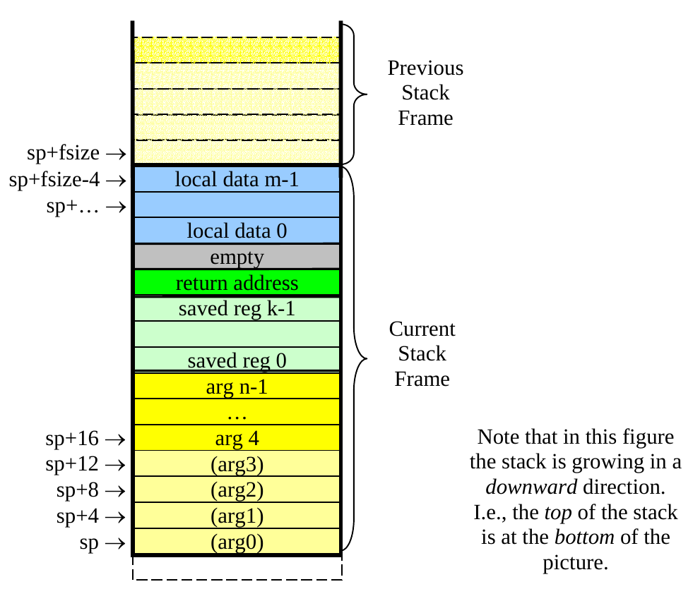

# 运行时存储布局

## 各种数据对象的内存表示

对于我们用到的数据类型，规定如下：

- 对于int类型的常量和变量，对应于32位带符号整数
- 对于bool类型的常量和变量，也使用32位带符号整数，以0表示false，1表示true
- 对于string类型的常量和变量，用字符串的首地址(32位)的来表示字符串，字符串本身不记录长度，使用0字符(即'\0')作为结束符
  - 不过string的表示方法对大家来说应该是透明的，因为decaf语言本身没有任何可以操纵字符串的手段，一切都依赖于外部函数
- 对于数组，采用运行时动态分配的方式来分配存储空间，所分配到的存储区域大小为数组长度加1个单元，每个单元为32位，其中第一个单元用于记录数组的长度，后面的单元均为数组内容，数组用指向**第一个元素**的指针(32位地址)表示
  - 也就是说，数组的长度在数组的字节偏移量-4处
- 对于类对象，也是采用运行时动态分配的方式来进行存储空间分配，所分配到的区域应该包含以下内容：第一个单元存放着这个对象所对应的类的虚表地址，后面的单元均用于存放与这个对象的各个成员变量，按照继承关系，辈分越高的类的成员变量排在越前面;对象用指向对应存储区域第一个单元的指针来表示

~~后面应该都可以不看了，和做实验关系不大~~

## 内存组织

一般来说，程序运行时的内存空间从逻辑上分为“代码区”和“数据区”两个主要部分，实际在os的内存管理中也可能利用段或者页表之类的机制来区分这两种内存，。顾名思义，代码区用于存放可执行的代码，而数据区用于存放程序运行所需的数据(例如临时变量，全局变量的空间等等)。

数据区按照所存放的数据和对应的管理方法分为全局数据区(静态数据区)，栈区，堆区三部分，这三个区里面的存储空间分配分别遵循三种不同的规则：静态存储分配(Static Memory Allocation)，栈式存储分配(Stack-based Allocation)和堆式存储分配(Heap-based Allocation)，其中后两种分配方式称为“动态存储分配”，因为这两种方式中存储空间并不是在编译的时候静态分配好的，而是在运行时才进行的。
    
1. 全局数据区(静态数据区)

  全局/静态数据区用于存放各种全局变量，静态变量还有类的虚函数表。静态存储分配的结果是编译的时候确定的，在进行编译的时候编译器根据全局变量等信息事先计算好所需的存储空间以及各变量在这个存储空间中的偏移地址。在C语言中全局数组的存储分配方法即为静态存储分配。

  静态存储分配并不是总适用的，对于一些动态的数据结构，例如动态数组以及递归函数可能需要的栈空间等最终空间大小必须在运行时才能确定的场合静态存储分配通常无能为力。
 
2. 栈区

  栈区顾名思义就是作为“栈”这样一种数据结构来使用的。栈区数据空间的存储管理方式称为栈式存储分配。与静态存储分配方式不同，栈式存储分配是动态的，也就是说必须是运行的时候才能确定分配结果的，比方说以下一个计算阶乘的代码片断：

  ```java
  int factorial (int n) { 
    int tmp; 
    if (n <= 1) {
      return 1; 
    } else { 
      tmp = n – 1; 
      tmp = n * factorial(tmp); 
      return tmp; 
    } 
  } 
  ```

  这段代码中，假设编译器没有优化掉这个递归的话，随着n的不同，所有`tmp`变量所需要的总内存空间大小是不同的，而且每次递归的时候tmp对应的内存单元都不同。诸如局部变量的栈式存储分配方法想必大家在学习C++或者汇编语言的时候已经有所了解，函数调用时的存储布局情况，请参考后面章节。

  分析函数调用时候的存储布局情况我们不难发现，进行栈式存储分配的条件是在编译的时候一般需要知道一个函数的活动记录有多大(以便在进入函数的时候动态地分配活动记录的空间)，如果这点不能满足，也许可以通过[Variable-length_array](https://en.wikipedia.org/wiki/Variable-length_array )或者别的什么动态申请栈内存的东西(例如gcc和clang都提供的`__builtin_alloca()`)来分配内存。如果要求灵活性再强一些，则应该使用堆式存储管理。

  一般来说，栈区中的数据通常都是函数的活动记录，活动记录中的数据通常是使用寄存器偏址寻址方式进行访问的。所谓寄存器偏址寻址方式，即在一个基地址寄存器中存放着活动记录的首地址，在访问活动记录某一项内容的时候只需要使用该首地址以及该项内容相对这个首地址的偏移量即可计算出要访问的内容在内存中的实际逻辑地址。这类数据包括了函数的实际参数以及局部变量等，具体细节请参考后续章节。
 
3. 堆区

  堆是栈以外的另一种动态存储分配结构。它有两个基本的操作：申请内存和释放内存。因为不要求申请和释放的内存的连续性，它的灵活性往往比栈要好，但是代价也可能更高一些。关于堆式管理在学术界和工业界都进行了广泛的研究和探索，有兴趣的同学可以参考 http://en.wikipedia.org/wiki/Dynamic_memory_allocation 。(其实我个人最感兴趣的是为啥它的名字叫堆，和数据结构中的堆有关系吗?可以参考 https://stackoverflow.com/questions/1699057/why-are-two-different-concepts-both-called-heap)

  对于c/c++这样的底层语言，堆的管理往往借助一层对os系统调用的封装，也就是libc库来实现;对于java这样基于虚拟机的语言来说，堆的管理往往借助虚拟机对os系统调用和libc库的更高层更复杂的封装来实现，目标是尽量贴合语言自身的性质。在这样的实现下，在某些对于很多需要频繁的堆内存申请的情况下，后者的性能的确有可能超越前者。

  在tac这个层次不用考虑那么多，直接调用intrinsic函数`ALLOCATE`即可。具体怎样实现它并不是现在关心的重点(事实上也不是以后的实验关心的重点)。

## 一般函数调用过程

不同平台上的函数调用过程可能差距很大，我们目前设定的目标平台是mips，这里简单描述一下mips调用约定中的函数的调用过程，注意这并不是说所有函数调用过程都必须这样进行，事实上这应该是最复杂的版本了，其中某些步骤可能可以省去。

0. (caller)保存caller-save的寄存器
1. (caller)传递函数的实参，前若干实参通过寄存器传递，后面的实参通过栈传递
   - 具体来说，前四个参数从左到右由\$a0-3传递，后续参数从左到右保存到地址依次增大的栈内存中
   - 注意传参的顺序与参数求值的顺序没有任何关系，参数求值可以从左到右，可以从右到左，也可以随便乱求
2. (caller)使用跳转语句跳转到函数入口，并把返回地址保存在\$ra寄存器中
3. (callee)保存callee-save的寄存器，包括\$ra，\$sp，\$fp
4. (callee)把基地值寄存器\$fp指向栈顶指针寄存器\$sp所指的位置
5. (callee)修改栈顶指针寄存器的值$sp，使得\$sp和\$fp之间的区域足够存放临时变量和需要保存的寄存器，以及它**再调用别人**传参需要的栈空间
6. (callee)保存callee-save的寄存器
7. (callee)执行函数体
8. (callee)恢复callee-save的寄存器，包括\$ra，\$sp，\$fp
9.  (callee)跳转回\$ra所指处
10. (caller)恢复caller-save的寄存器

关于\$fp，只要函数没有用到动态栈内存申请，就可以当这个寄存器不存在，完全不需要保存/恢复/使用它。

栈的大致结构是这样的：


