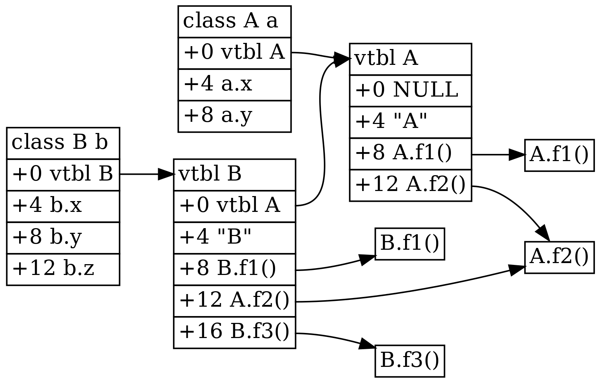

# 面向对象机制

## 传统的方案

decaf的面向对象机制是传统的虚表机制：每个对象中都隐藏了一个指向虚表的指针。调用虚函数的时候，首先从对象指针指向的内存中读出虚表指针，然后再从虚表指针指向的内存中，在一个编译期就可以确定的偏移量处读出函数指针，最后将对象指针作为函数的隐藏的this参数调用函数。

在我们的实现中，虚表中不只存放了函数指针，还存放了一些额外的用于描述类型的信息。例如为了支持`instanceof`的动态类型判断，需要不断沿着继承链向上查找，因此可以想象虚表中需要存储关于本类的父类的信息；为了能够在类型强制转化失败时输出类型的名字，可以想象虚表中需要存放类型名字的字符串。

具体来说，虚表的第0个slot存放指向父类的虚表的指针(如果没有父类则为空指针)，第1个slot存放指向类名字符串的指针，后面的slots都存放函数指针。函数指针的存放顺序是：

1. 辈分越高的类的函数越靠前，同一个类中按照函数的声明顺序排序
2. 子类如果复写了祖先的虚函数，那么使用祖先的函数指针用的slot来存放它的函数指针，否则就依次跟在后面。

而对象的内存布局则是，第0个slot存放指向虚表的指针，后面的slots存放成员变量。辈分越高的类的成员变量排在越前面，同一个类中按照变量的声明顺序排序。

一个简单的例子如下：

```java
class A {
  int x;
  int y;
  void f1() { }
  void f2() { }
}

class B extends A {
  int z;
  void f1() { }
  void f3() { }
}
```

对应的对象和虚表的结构为：



这种基于嵌在对象内部的虚表指针来实现面向对象机制的方案大家在之前的oop课上都应该已经比较熟悉了，它的优势在于保持了指针的大小不变，用于传参和赋值的时候不需要额外处理，可以与没有内建面向对象机制的c语言等代码兼容；它的劣势在于限定死了虚表的组织结构：每个子类中，虚表内函数指针的排列位置必须与父类兼容，这样把它的指针传给接受父类的指针的函数时，才能够使用同样的偏移量来访问。这样的限制使得多继承等概念很难表达，要么就是像java一样直接不支持，要么就是像c++一样虽然支持，但是同时带来了很大的麻烦。

~~后面应该都可以不看了，和做实验关系不大~~

## 动态类型判断的实现

如同上面的图中描述的一样，目前框架中的动态类型判断(`instanceof`和强制类型转换用到)的实现方法方法是在虚表中存储父类的虚表地址，然后不断沿着继承链向上查找，如果找到了目标类型的虚表指针，证明`instanceof`结果为`true`，或者强制类型转换成功；如果直到遇到空指针都没有找到目标类型的虚表指针，证明`instanceof`结果为`false`，或者强制类型转换失败。

其实这差不多也是gcc处理c++中的动态类型判断(rtti, run-time type identification)的实现方法，看一下生成的汇编就可以差不多看出来(省略了一些不必要的信息)：

```cpp
struct  A {
    virtual ~A() {}
};

struct  B : A {};

struct  C : B {};
```

```x86asm
typeinfo for A:
        .quad   vtable for __cxxabiv1::__class_type_info+16
        .quad   typeinfo name for A
typeinfo for B:
        .quad   vtable for __cxxabiv1::__si_class_type_info+16
        .quad   typeinfo name for B
        .quad   typeinfo for A
typeinfo for C:
        .quad   vtable for __cxxabiv1::__si_class_type_info+16
        .quad   typeinfo name for C
        .quad   typeinfo for B
vtable for C:
        .quad   0
        .quad   typeinfo for C
        .quad   C::~C() [complete object destructor]
        .quad   C::~C() [deleting destructor]
```

大致可以看出`typeinfo`中的第二项和类型的继承关系是比较符合的。当然这在c++中只是最简单的情形，还有各种奇怪的继承方式，那就远超出decaf的能力范围了，这里不做考虑。为了避免代码膨胀，一般来说gcc不会把`dynamic_cast`完全展开成汇编，而是转发调用一个glibc提供的内部函数。现在我们的框架为了简单起见就把`instanceof`等完全展开成了tac，也许以后我们也会考虑采用类似gcc的方案。

容易看出，这样实现的动态类型判断开销较大，即使是像decaf这样的简单的单继承模型，也至少需要一个循环才能给出结果。如果这是一个相当频繁的操作的话，还是会带来很大的性能损失。像scala这样的语言，虽然频繁地使用动态类型判断来实现模式匹配，不过它们其实不是很在乎性能，一般都把这个重担完全交给jvm了。

llvm可以算一个既需要频繁的动态类型判断，同时也很在乎性能的例子。它是用c++实现的，不过基本上完全避开了c++原生的rtti，而是自己实现了一套。简单来说，对于一个只允许单继承的继承树，从根节点(如果没有一个统一的根节点，可以考虑人为添加一个虚拟的公共父类，类似java中的`Object`)开始进行dfs。维护一个编号，遇到一个新的类时编号自增，如果遇到A时的编号，在遇到B时的编号和对B的dfs结束时的编号之间，证明类A是类B的子类。把这个编号存储在对象中(或者存储在虚表中)，动态类型判断的时候取出来比较一下即可。

这个实现方案显然效率很高，但是它并不适合编译器来自动完成：它要求编译器必须在编译时了解整个程序的所有信息，这并不符合实际情况(即使有lto也不行，否则这个程序很难进行例如加载动态库这样的操作)。如果手动来做的话，并不需要把区间卡的那么死，可以留出来很多用于未来拓展的编号。不过这个缺点其实在目前的decaf编译器中其实并不存在(我们并不支持多文件)，也许未来我们会考虑这种方案。

## 胖指针方案

还有另一种基于胖指针的面向对象机制，比较新的语言如rust和go都采用了这样的机制来实现动态分发(不过它们并不算是面向对象语言，只是像面向对象语言一样支持动态分发)。它的实现方法是将"对象指针"表示成两个指针，一个指向对象的数据，一个指向虚表。例如rust中的trait object机制的实现机制大致如下[trait-objects](https://doc.rust-lang.org/1.30.0/book/first-edition/trait-objects.html)：

```rust
pub struct TraitObject {
    pub data: *mut (),
    pub vtable: *mut (),
}
```

对于一个需要实现动态分发的trait，为它生成一个虚表类型：

```rust
struct FooVtable {
    destructor: fn(*mut ()),
    size: usize,
    align: usize,
    // methods ...
}
```

当需要将一个普通的struct传递给一个接受trait object的函数时，编译器插入一些代码把它的虚表指针一起传进去。一个显然的好处在于如果一个实现了某trait的struct从来没有当做trait object来使用，那么就不必浪费空间来存储虚表指针。另外，在这种机制下实现"多继承"也是很容易的：对于一个`dyn Foo + Bar`，只需要把`Foo`和`Bar`的函数一起放进虚表即可。当然，这并非c++意义上的多继承，因为trait只描述对象的接口，不包含任何数据。

go的interface的实现原理也是类似的，可参考[golang-interface-implementation](https://www.tapirgames.com/blog/golang-interface-implementation)。
