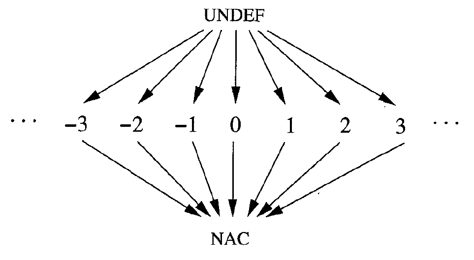

# 常量传播

常量传播的目的在于发掘代码中可能存在的常量，尽量用对常量的引用替代对虚拟寄存器的引用，并尽量计算出可以计算的常量表达式。

它与将ast翻译为tac阶段所做的常量折叠有一定的相同之处：前者可以完全实现后者的功能。但是后者仍然是必要的，之前已经解释过这是语义规范上的限制，前者是一个可选的优化，即使不实现它也是可以的；而后者能够决定代码是否能通过编译，是语言规范的一部分，是必须实现的。类似于：

```java
int foo() {
  int a;
  a = 0;
  while (a == 0) ;
}
```

这样的代码经过常量传播显然可以看出控制流不会达到函数的末尾，但是这仍然被认为是一个编译错误，这也是java规范和javac采取的策略。

为了实现常量传播，类比于前两种数据流，不难想象常量传播的数据流是"可用常量分析"，找出在一条语句处有哪些对虚拟寄存器赋的常量值可以到达。每一条涉及到赋值的语句处，杀死之前与左端项相关的赋值，如果右端项为变量则生成对左端项的变量赋值；反之如果对左端项赋予了一个常量值或者常量表达式，则生成对左端项的常量赋值。

当两个基本块交汇的时候，对于每个虚拟寄存器，需要考虑以下几种情况：

- 如果任何一个基本块生成了一条对它的变量赋值，则交汇结果为变量
- 如果两个基本块都生成了对它的常量赋值
  - 如果这两个常量值相等，则交汇结果为常量，否则为变量
- 如果两个基本块中，一个生成了对它的常量赋值，另一个没有生成对它的赋值，则交汇结果为常量
- 否则(两个基本块都没有生成对它的赋值)，交汇结果为没有赋值

上面的"变量"，"没有赋值"，"常量"三种情况，就对应了半格中的三类元素：`NAC`，`UNDEF`和"常量"。其中"常量"并不是单个元素，而包含无数(或者有限但数量过于巨大，合理的时间内无法一一列举)种常量的具体取值。一个典型的整数虚拟寄存器的半格如图所示：



初值为对所有虚拟寄存器都赋值`UNDEF`，这表示目前还不知道任何关于它的信息。

简单起见，实验框架只实现了对整数的常量传播，而像字符串这些地址则没有实现，不过这也足够展示常量传播的关键点了。