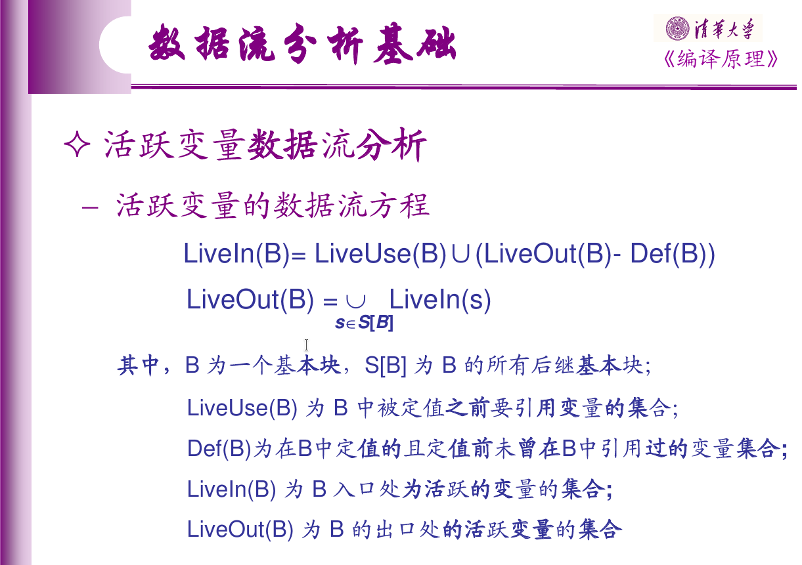

# 死代码消除

死代码消除即无用代码消除，和不可达代码消除是两个概念。前者指的是消除执行之后没有任何作用的代码，后者指的是消除永远无法被执行到的代码。事实上现在框架中有不可达代码消除的优化，是在构造流图和常量传播的时候进行的。

我们要求基于活跃变量分析进行死代码消除，不要求基于Faint Variables Analysis。理论上来说Faint Variables Analysis的效果应该是一定不会更差的，但是实现也一定会更复杂，不建议大家做它(做了也不会有额外奖励)。

本来这一节应该是这几种优化中最简单的一个的(从代码行数可以直接看出)，不过因为这是大家的实验任务，所以这里还是讲解的详细一些。首先来推导活跃变量分析的几个集合是怎么来的，这个推导对于到达-定值分析也基本上适用，可以帮助大家理解那几个集合的意义。

活跃变量分析为每个程序点计算出所有变量的集合的子集，用于表示该点处活跃的变量，所以数据流分析的值集为所有变量的集合的幂集。"活跃"的含义是在程序执行过这一点**之后**，这个变量**当前的值**会被使用到，所以数据流分析是后向的。对于单个语句$$S$$，传递函数要根据$$S$$之后活跃的变量计算$$S$$之前活跃的变量，计算方法为：所有$$S$$用到的变量在$$S$$之前都是活跃的，所有$$S$$之后活跃的变量，如果没有在$$S$$中被定值，证明未来的那次使用用的还是$$S$$之前的值，所以也是活跃的。

综合得，传递函数定义为：$$f_S(x) = (x - def_S) \cup use_S$$。其中$$def_S$$是$$S$$中定值的所有变量的集合，$$use_S$$是$$S$$中使用的所有变量的集合。

基本块$$B$$的传递函数定义为：

$$
f_B(x) = f_{S_1}(...f_{S_{n - 1}}(f_{S_n}(x))) \\
= (((((x - def_{S_n}) \cup use_{S_n}) - def_{S_{n - 1}}) \cup use_{S_{n - 1}} ...) - def_{S_1}) \cup use_{S_1}\\
\overset{\mathrm{数学归纳法}}{=} (x - \bigcup_{i = 1}^n def_{S_i}) \cup \bigcup_{i = 1}^n (use_{S_i} - \bigcup_{j = 1}^{i - 1} def_{S_j})
$$

最后一个等号使用数学归纳法来证明，读者自证不难。

定义$$def_B = \bigcup_{i = 1}^n def_{S_i}$$，$$use_B = \bigcup_{i = 1}^n (use_{S_i} - \bigcup_{j = 1}^{i - 1} def_{S_j})$$，这样上面的式子就是大家熟悉的形式了。这个形式和课堂上定义的$$LiveUse$$和$$Def$$应该是一致的：

先看$$use_B$$和$$LiveUse$$，$$LiveUse$$为$$B$$中定值之前被引用的变量的集合，而$$use_B$$定义中每一个求并项都是一条语句的$$use$$集合减去在这条语句前面的所有$$def$$集，也就是说如果一个变量在某条语句中被使用了，而且没有在这条语句之前的任何一条语句被定值，那么它属于$$use_B$$，此外都不属于。显然，这与$$LiveUse$$的定义是符合的。

再看$$def_B$$和$$Def$$，其实很容易可以看出这两个集合并不相同，$$def_B$$包含了被定值的所有变量，而$$Def$$要求定值之前没有引用过。然而这个区别不会影响最终的计算结果，如果有一个定值之前被引用过的变量，那么它属于$$def_B$$而不属于$$Def$$，然而同时它也属于$$use_B$$和$$LiveUse$$，也就是说它一定在最后的结果集合中。

> 所以说，$$Def$$这样的定义是冗余的，只会加大计算$$Def$$时的计算量，而如果使用$$def_B$$的定义就会简单一些，而且不会影响最终结果

在实验框架中为了实现死代码消除，大致流程是首先计算每个$$def_B$$和$$use_B$$，以此解出每个$$in_B$$和$$out_B$$，然后利用它们来计算每个$$out_S$$，边计算$$out_S$$边执行死代码删除。**具体每一步怎样做，可以参考其它几个数据流分析的实现。**这里讲一下几个常见的需要注意的点：

1. 计算$$def_B$$和$$use_B$$的时候不用像定义式一样算，而是(反向)遍历一遍基本块中的每个语句并同时维护这两个集合。计算$$out_S$$也是类似的
2. 对于方程的求解，`Flow`已经提供了求解的工具。它是基于前向数据流的。根据之前的讲解大家应该知道怎么利用它来求解后向数据流
3. 进行死代码删除的时候，如果一条语句**没有副作用**，而且它的赋值目标(如果有的话)不在$$out_S$$中，那么这条语句就可以删去
   - 所谓的副作用，其实就是除了"改变赋值目标变量"之外，其他所有的作用。显然，tac中没有既没有副作用，同时也没有赋值目标的语句
   - 你在实现的时候可以认为除了`a = call b`之外的所有有赋值目标的语句都是没有副作用的，对于`a = call b`，如果$$a \notin out_S$$，要求将它优化为`call b`

其实还有一些语句的"副作用"不是很明确，比如load指令`a = *(b + imm)`和一部分计算指令，如除0，有符号整数溢出等(依平台而定)，可能会导致程序崩溃，但是**优化的时候可以不把这当成是副作用**：按照c/c++常用的说法这叫未定义行为，这可以减轻编译器作者的负担，编译器可以假定程序永远没有未定义行为，并以此为依据来优化。

目前decaf并没有这方面的严格的语言标准，为了让大家的实现尽量简单，我们姑且认为不合法的访存和运算都是未定义行为，所以这样的指令是可以优化掉的。