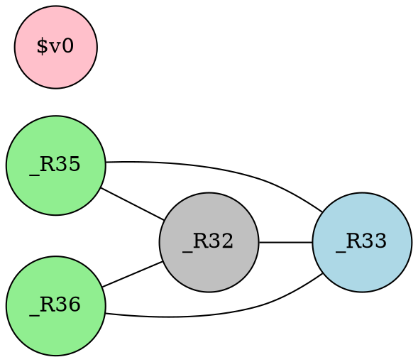

# 图着色寄存器分配原理

为了将实际寄存器分配给虚拟寄存器，需要得知哪两个虚拟寄存器不能使用同一个实际寄存器。由虚拟寄存器构成图的节点，"不能使用同一个实际寄存器"的关系构成了图的边(无向图)，于是寄存器分配就转化成了在这张图上使用平台提供的寄存器数$$K$$来进行$$K$$着色(假定图着色的定义大家都已经理解了)。

通过课上的讲解和其他的资料大家应该已经了解了，两个虚拟寄存器不能使用同一个实际寄存器的条件是：存在一条语句，这条语句中一个虚拟寄存器被定值，这条语句后另一个虚拟寄存器活跃。

下面以这个函数为例讲解：

```java
static int gcd(int a, int b) {
  while (a != 0) {
    int c = b % a;
    b = a;
    a = c;
  }
  return b;
}
```

经过指令选择我们会得到(有一定修改，且省略了prologue和epilogue的部分，"调用约定"一章会讲解这两个部分)：

```mipsasm
...
  # _R32是a，_R33是b，_R34被优化掉了，_R35是c，_R36是计算a != 0的临时结果
  j _L3
_L2:
  rem _R35, _R33, _R32
  move _R33, _R32
  move _R32, _R35
_L3:
  sne _R36, _R32, 0
  bnez _R36, _L2
  move $v0, _R33
...
```

注：

1. 以_R开头的都是虚拟寄存器，它们的计数从32开始，这样就可以用数值范围来区分虚拟寄存器和实际寄存器了(也许这在rust里算一个anti-pattern，但是至少在这里我觉得还是比较方便的)
2. 最后条语句中有实际寄存器\$v0出现，在mips调用约定中\$v0用于存放返回值，因此出现了这条语句。从这条语句可以看出，指令选择生成的伪汇编并不是只能包含虚拟寄存器，也可以包含实际寄存器，这在后续的"预着色节点"一章中会有更详细的说明
3. 倒数第2，3行看起来有点多余，`sne`和`beqz`其实可以用一条`beqz`来代替，这是因为指令选择中基本没有做什么优化，基本就是原样翻译了tac(同时tac中也没有做相关的优化)。这种冗余可以用窥孔优化来消除，然而们并没有实现

从tac的流图，生成带有虚拟寄存器的汇编代码后，流图信息得到保留，无需再次划分基本块，但是活跃变量分析需要以汇编代码为对象进行，这与之前以tac为对象进行的活跃变量分析是类似的，下面直接给出最终结果，注释里的是本条语句执行**后**的$$LiveOut$$集合：

```mipsasm
...
# BB 1
  j _L3 # [_R32, _R33]
# BB 2
_L2:
  rem _R35, _R33, _R32 # [_R32, _R35]
  move _R33, _R32 # [_R33, _R35]
  move _R32, _R35 # [_R32, _R33]
# BB 3
_L3:
  sne _R36, _R32, 0 # [_R32, _R33, _R36]
  bnez _R36, _L2 # [_R32, _R33]
# BB 4
  move $v0, _R33  # [$v0]
...
```

$v0虽然作为传递函数返回值使用，但是也可以作为通用寄存器参与一般的计算，所以在进行活跃变量分析的时候需要考虑它。最后\$v0活跃的原因是在更后面在返回语句处(这里没有写出来)将\$v0标记为活跃。

构建干涉图，一个合法的图着色如下：



粉色对应\$v0，灰色对应\$a0，蓝色对应\$a1，绿色对应\$a2，这样即得到了分配完成的程序：

```mipsasm
...
  j _L3
_L2:
  rem $a2, $a1, $a0
  move $a1, $a0
  move $a0, $a2
_L3:
  sne $a2, $a0, 0
  bnez $a2, _L2
  move $v0, $a1
...
```

显然粉色对应于\$v0是强制的，不过灰色和蓝色对应的寄存器也不是任意选择的，而是利用了后面会讲到的干涉图节点合并，将函数传参用的\$a0和\$a1与虚拟寄存器进行了节点合并，这样就避免了将调用约定规定的用于传参的\$a0和\$a1复制给_R32和_R33的指令。

最终完整的`gcd`函数如下：

```mipsasm
gcd:
  j L3
L2:
  rem $a2, $a1, $a0
  move $a1, $a0
  move $a0, $a2
L3:
  sne $a2, $a0, 0
  bnez $a2, L2
  move $v0, $a1
Ret:
  jr $ra
```

基本上没有对编译器的输出做什么改动，只是将标号的名字稍作修改以增强可读性。可见，除了`sne`和`bnez`两句之外，寄存器分配完之后已经几乎没有什么冗余代码了，prologue和epilogue代码被完全消除了，效果还算相当不错。

当然，为了得到这样的结果，首先需要你们正确实现论文中的寄存器分配算法，如果使用框架自带的暴力寄存器分配，会得到一大堆相当丑陋冗余的代码。